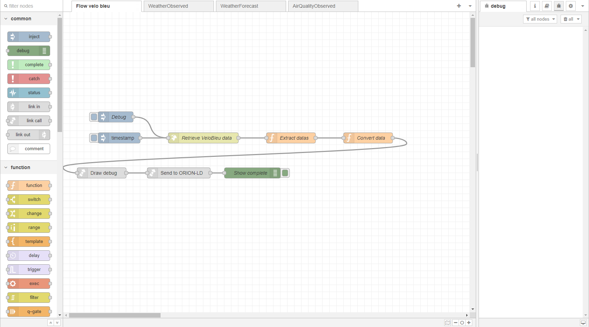

# Configuration de la base de donnees

# ✅ Etapes

Sur l’accueil de nodered:

1. Ouvrir le menu déroulant en haut a droite de la fenêtre principale, et sélectionner **afficher les flows cacher**.

1. Choisir d’afficher **“send to orion”**

Vous êtes donc sur le flow responsable d’envoyer les données à Orion.

Continuer sur …

[Editer les headers](Editer%20les%20headers%209d647ecddb1c4a55952dcbd2d94dad1d.md)

[Editer la méthode ou l’adresse du serveur](Editer%20la%20me%CC%81thode%20ou%20l%E2%80%99adresse%20du%20serveur%209c47f6dd91054096a9fdcf4dad4e35bc.md)