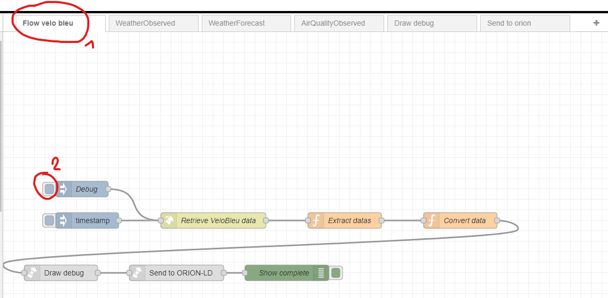

# Execution des services

## Standalone

Dans le répertoire du serveur,

1. Installer les dépendances

```bash
npm install
```

1. Démarrer le services

```bash
npm start
```

## Sur nodered

Dans nodered,



1. Ouvrir le flow souhaité
2. Cliquer sur la case bleu souhaité:

*Le nœud Debug permet de lancer le flow en retournant les valeurs envoyées au serveur dans la console.*