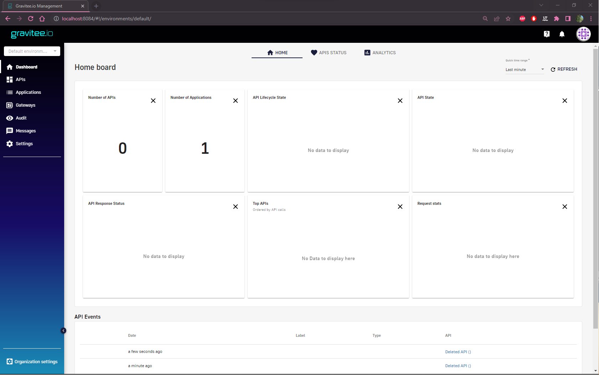

# Mettre en place l’API

# Accès au portail

Une fois le service lancé rendez-vous dans votre navigateur et accéder au management_ui exposé sur le port 8084 :

Vous devriez voir ceci:

# Ajouter une API

Pour ajouter un fournisseur de base de données, il faut créer une API pour le représenter et lui appliquer des règle. Pour cela, rendez-vous dans la section API dans la Sidebar de l’interface:

Cliquer sur ajouter en bas à droite de la page,

Continuer avec le formulaire, maintenant vous devez obtenir le formulaire de configuration de l’API:

Renseigner dans la première page du formulaire les informations propre à la représentation de l’API:

- Le nom
- La version
- La description
- et enfin sur qu’elle route l’API sera exposé.

Une fois remplis cliquer sur “next”:

Ici les information relative à l’API qui est “proxié”. Renseigner ici le endpoint sur lequel le service est servie. Dans le cas de Orion-LD cela devrait être: **“http://orion-ld:1026”**, et pour mintaka: **“http://mintaka:8070”**. 

La troisième page, est utile pour définir plusieurs plan pour l’accès aux données par exemple augmenter la latence pour un certain type d’utilisateur, etc…

Dans notre cas, nous allons créer un seule plan qui permet l’accès basique à la base de données.

Par exemple: 

Le quatrième permet de charger une documentation:

Finalement, on peut créer l’API et la déployer :

# Configurer l’accès au base de données

Depuis la page d’accueil on peut sélectionner l’API, en passant par la Sidebar> APIs:

Sélectionner l’API.

Une fois l’API sélectionné, rendez-vous dans Design dans la Sidebar:

Ici, que la règle que l’on s’apprête à configurer ne s’applique à toutes les route du plan créé plus tôt.

Dans le volet de droite, on voit tout les modules qui peuvent être appliqué aux requêtes.

On choisira dans notre cas les modules:

- Transform Header: Qui permet de modifier les headers de la requête.

Ce module attends que l’on choisisse comment modifier les headers. Dans le cas de Orion-LD, on peut configurer l’accès de Tenant en spécifiant le header **“NGSILD-Tenant”.** Nous voulons que chaque application soit considéré comme un tenant différent donc on attribuera la valeur de l’identifiant de l’application au header NGSILD-Tenant.

On choisi donc, d’ajouter une action de modification ou d’ajout de header:

puis dans le premier champ, on peut renseigner “**NGSILD-Tenant**” et dans le second: “**{#context.attributes.application.replaceAll("-", "")}**” pour récupérer l’id de l’application.

Enfin on clique sur valider:

Puis sur “Save”:

# Publier l’API

Une fois l’API sélectionné, Allez dans la rubrique “Portal” de l’API: 

Puis sur “Publish API”:

Remarque: Pour rendre l’API publique et donc visible pour d’autre développeur, cliquer sur “Make public”